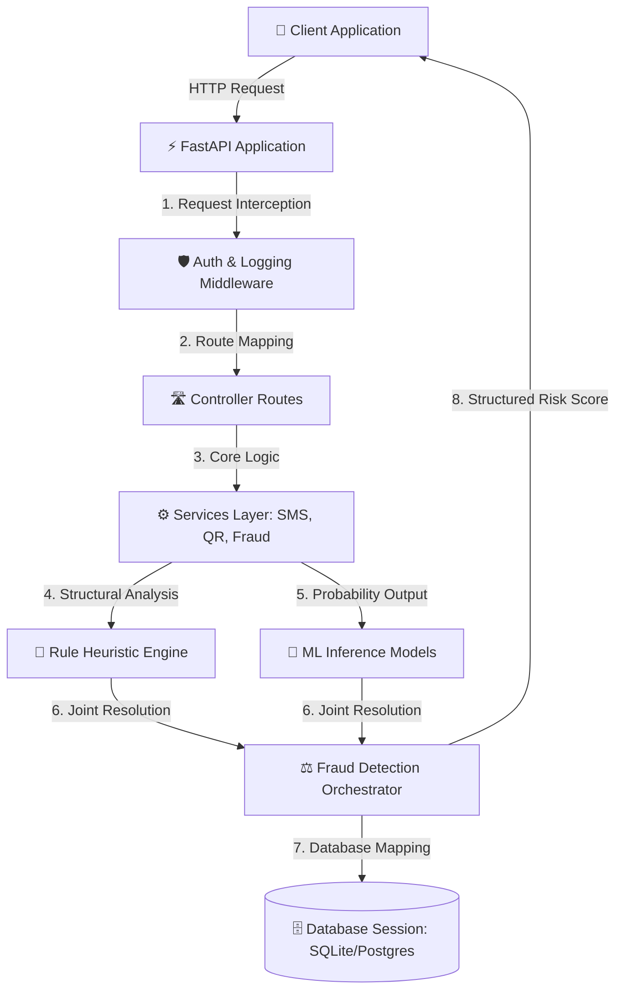

# 🛡️ SafePay AI — Enterprise-Grade Fraud Intelligence Backend

SafePay AI is a state-of-the-art, enterprise-grade hybrid artificial intelligence fraud detection backend designed to secure digital payments, specifically targeting UPI ID fraud, QR code scams, phishing SMS content, and suspicious URL links. 

By combining **Machine Learning Classifiers (Scikit-Learn/NLP)** with **Heuristic Rule Engines**, SafePay AI delivers real-time risk scores, behavioral threat intelligence, and automatic security alerts to safeguard modern financial applications.

---

## 🚀 Key Features

*   **🔐 Enterprise JWT Authentication**: Secure user management, registration, roles (user, moderator, admin), and token-based route protections.
*   **🧠 Hybrid Intelligence Engine**: Combines machine learning probability models with structural heuristical rule sets to calculate high-fidelity risk scores.
*   **📸 QR Code Scanning & Decoder**: Real-time decoding of QR images (`PNG`, `JPEG`, `JPG`) using Computer Vision (`OpenCV`, `pyzbar`), UPI details parsing, and merchant risk categorization.
*   **📩 SMS Intelligence Service**: Analyzes incoming messages for phishing, OTP fraud detection, spam keyword matching, sender reputation tracing, and URL extraction.
*   **🔍 URL Fraud Analysis**: Evaluates malicious web links by analyzing length, subdomain counts, number frequencies, entropy, IP hosts, and blacklisted patterns.
*   **🖥️ Startup Diagnostics & Self-Healing**: Automatically ensures directory structure integrity, executes database connectivity validation, and performs startup ML model health tests upon launcher activation.
*   **🐳 Dockerized Deployment**: Built with production-ready, lightweight, non-root user hardening, structural layer optimizations, and automated API-level healthchecks.

---

## 📂 Repository Directory Structure

Below is an exhaustive, file-by-file blueprint detailing the modules, packages, and scripts present in this workspace:

```text
BACKEND/
├── .env                              # Local environment variables configuration (DB URL, Secrets)
├── Dockerfile                        # Multi-stage production container instructions (hardened, non-root)
├── requirements.txt                  # Consolidated Python package dependencies (FastAPI, ML, CV)
├── run.py                            # Central CLI application launcher with startup system diagnostics
├── safepay.db                        # SQLite database file generated during startup fallback
│
└── app/                              # Core Application Codebase
    ├── main.py                       # Global FastAPI entrypoint, middlewares, and lifecycle routines
    ├── config.py                     # Pydantic Settings centralized validation and environment loading
    ├── dependencies.py               # Dependency injection providers (Auth, DB session, API Key guards)
    │
    ├── api/                          # REST API Routing Submodule
    │   ├── middleware/               # Custom Interceptors
    │   │   ├── auth_middleware.py    # Request-level authorization and validation middleware
    │   │   └── logging_middleware.py # Real-time process logging and performance analytics middleware
    │   │
    │   └── routes/                   # API Controller Routing Endpoints
    │       ├── auth_routes.py        # User login, registration, and credential verification
    │       ├── fraud_routes.py       # UPI payment fraud scanners and hybrid scoring pipelines
    │       ├── health_routes.py      # Detailed healthchecks (DB, ML, Redis, System uptime)
    │       ├── qr_routes.py          # Decodes and analyzes uploaded QR codes or base64 frame feeds
    │       └── sms_routes.py         # Inspects SMS texts, bulk messages, and detects banking alerts
    │
    ├── database/                     # Persistence Layer Submodule
    │   ├── db.py                     # SQLAlchemy session initialization and engine connection management
    │   ├── models.py                 # Declarative database tables and ORM entities schema
    │   └── schemas.py                # Pydantic data schemas for incoming validation and outgoing serialization
    │
    ├── ml/                           # Artificial Intelligence Submodule
    │   ├── data/                     # Raw datasets in CSV format
    │   │   ├── text_scam_dataset.csv # Labeled datasets mapping SMS phishing texts
    │   │   ├── upi_fraud_dataset.csv # Transactions datasets featuring fraudulent UPI ID parameters
    │   │   └── url_fraud_dataset.csv # Curated list of malicious URLs and domain ratings
    │   │
    │   ├── features/                 # Data Preprocessing & Vectorization
    │   │   └── text_features.py      # Feature engineering, TF-IDF vectorizers, and text cleanups
    │   │
    │   ├── inference/                # Real-Time Predictors
    │   │   ├── text_predictor.py     # Classifies SMS scams and outputs probability parameters
    │   │   └── upi_predictor.py      # Computes transaction risks and flags fraudulent accounts
    │   │
    │   ├── models/                   # Serialized ML Model Registry
    │   │   ├── model1_upi.pkl        # Scikit-learn Random Forest model for UPI transaction risks
    │   │   ├── model2_text.pkl       # Naive Bayes text scam classifier vectorizer
    │   │   └── model3.pkl            # Integrated hybrid model for unified scam scores
    │   │
    │   ├── plots/                    # Output plots (Receiver Operating Characteristic, confusion matrices)
    │   │
    │   └── training/                 # Model Refinement and Training Scripts
    │       ├── model1_upi_fraud_classifier.py  # Script for training the transaction anomalies model
    │       ├── model2_text_classifier.py       # Script for training the text scams classifier
    │       ├── model3_url_fraud_analyzer.py    # Script for domain rating and URL analysis models
    │       └── train_models.py                 # Master pipeline executing all training schedules sequentially
    │
    ├── services/                     # Orchestrated Core Services Submodule
    │   ├── fraud_detection_service.py# Primary orchestrator combining ML inference with Rule Heuristics
    │   ├── qr_service.py             # CV-based QR image interpreter, metadata extractor, and UPI parser
    │   ├── risk_score_service.py     # Comprehensive transactional threat modeling and risk calculation
    │   ├── rule_engine.py            # Structural rule-base (PSP verification, entropy, amounts, time limits)
    │   └── sms_service.py            # High-performance scanner targeting sender ID, URLs, and phone patterns
    │
    ├── utils/                        # Shared Helper Submodule
    │   ├── constants.py              # Fixed security keys, blacklists, patterns, and response status codes
    │   ├── helpers.py                # Time conversion tools, mathematical modifiers, and formatting helpers
    │   ├── logger.py                 # Structured console/file logging layout with colored formats
    │   └── validators.py             # Custom validators enforcing safe email, phone, and password parameters
    │
    └── tests/                        # Automated Verification Test Suite
        ├── test_api.py               # Integration tests simulating mock endpoint queries
        ├── test_ml.py                # Machine learning prediction correctness verification checks
        └── test_rules.py             # Rule engine boundary validations and scoring rules tests
```

---

## ⚙️ Architecture & Dataflow

SafePay AI works on a multi-tiered pipeline that filters inputs from client requests through to the machine learning and persistence layers:



---

## 🔧 Installation & Setup

### Prerequisites

*   Python (version 3.10 or 3.11 is recommended)
*   **Windows Environment Dependencies**: OpenCV requires proper visual redistributables. Ensure that `zbar` libraries are installed locally for QR processing to work out of the box.

### 1. Clone the Codebase & Access Backend Directory
Ensure you are located inside the `BACKEND` directory in your workspace terminal:
```bash
cd BACKEND
```

### 2. Configure Local Environment Variables
Create a local `.env` file in the root directory by renaming or configuring custom attributes:
```ini
DATABASE_URL=sqlite:///./safepay.db
SECRET_KEY=YOUR_SECURE_32_CHARACTER_JWT_SECRET_KEY
JWT_SECRET_KEY=YOUR_SECURE_32_CHARACTER_JWT_SECRET_KEY
ENVIRONMENT=development
DEBUG=True
PORT=8000
HOST=0.0.0.0
```

### 3. Initialize Python Virtual Environment & Dependencies
Establish an isolated workspace, activate it, and install required system packages:
```bash
# Create Virtual Environment
python -m venv env

# Activate Virtual Environment (Windows PowerShell)
.\env\Scripts\Activate.ps1

# Activate Virtual Environment (Windows cmd)
.\env\Scripts\activate.bat

# Install all workspace dependencies
pip install -r requirements.txt
```

### 4. Train the ML Models
Before launching the service, you must build and serialize the machine learning models. Trigger the automated master training pipeline script:
```bash
python app/ml/training/train_models.py
```
This process trains all UPI classification, text spam classifiers, and URL analyzers, exporting serialized `.pkl` files to the `app/ml/models/` folder.

---

## 🏃 Run the Application

SafePay AI features a highly diagnostic terminal CLI bootloader `run.py`.

### A. Run in Development Mode (Auto-Reload Enabled)
```bash
python run.py
```

### B. Run in Production Mode (Pre-compiled Workers)
```bash
python run.py --prod
```

### C. Run on Custom Hosts/Ports
```bash
python run.py --host 127.0.0.1 --port 9000
```

Once running successfully, you can access the following pages:
*   **🌐 Active Server**: `http://localhost:8000`
*   **📘 OpenAPI Swagger Documentation**: `http://localhost:8000/docs`
*   **📕 ReDoc Alternative Portal**: `http://localhost:8000/redoc`
*   **🛰️ Lightweight Server Ping Check**: `http://localhost:8000/ping`
*   **📊 Live Frontend Dashboard**: `http://localhost:8000/dashboard`

## 🧩 Chrome Extension Integration

This repository now includes a Chrome extension in the `chrome-extension/` folder that connects directly to the SafePay backend.

### How to install
1. Start the backend: `python run.py`
2. Open Chrome and navigate to `chrome://extensions`
3. Enable Developer mode
4. Click **Load unpacked** and select `BACKEND/chrome-extension`
5. Use the popup UI to register/login and scan text, UPI, or QR code images

### Notes
* The extension communicates with `http://localhost:8000`
* Backend CORS is configured to accept Chrome extension origins
* Authentication uses bearer JWT tokens stored in Chrome local storage

---

## 🐳 Docker Deployment

To package, run, and scale SafePay AI inside optimized container environments:

### 1. Build the Production Image
```bash
docker build -t safepay-ai:latest .
```

### 2. Run the Container
```bash
docker run -d --name safepay-backend -p 8000:8000 safepay-ai:latest
```
This builds and launches the FastAPI service backed by health monitors on port `8000`.

---

## 🧪 Testing Suite

Automated verification checks are set up under `app/tests`. To trigger unit tests, regression checkers, and rule validation suites:
```bash
pytest app/tests/
```
For generating test coverage reports:
```bash
pytest --cov=app app/tests/
```

---

## 📚 Backend Documentation

A full backend architecture and API reference is available in:

- `BACKEND_DOCUMENTATION.md`
# Safe-pay-AI

